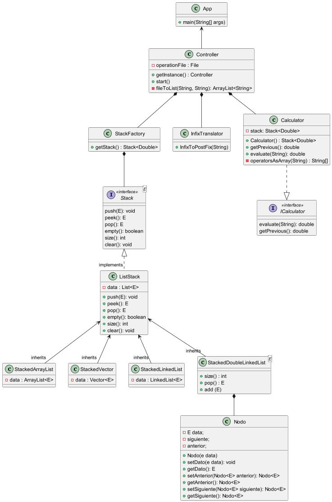

# Hoja de Trabajo 4

Elaborado con java 17 y maven.

**Código fuente:**  [*Aquí*](https://github.com/DanielRasho/HT4-InfixCalculator/tree/main/App_main/src/main/java)

**Unit Test:** [*Aquí*](https://github.com/DanielRasho/HT4-InfixCalculator/tree/main/App_main/src/test/java/App_main)

## Integrantes

- Daniel Rayo 22933

- Angela Rossana 22869

- Edwing de León 22809 

- Diego Linares 221256

---

## Cómo ejecutarlo?

1. Escribir los datos para operar en un fichero.

2. Ejecutar el codigo ubicado en `App_main/target/classes` con el siguiente comando:
   
   ```bash
   java -jar <Projecto.jar> <ruta>
   Ejemplo:
   java -jar App_main-1.0-SNAPSHOT.jar ./datos.txt
   ```

## UML

  


